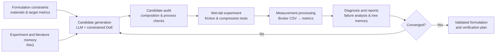

# PVA Formulation Optimization in Friction

An LLM-assisted, closed-loop workflow for optimizing poly(vinyl alcohol) (PVA) hydrogel formulations for low-friction applications. The project turns formulation constraints, tribology measurements, and experimental observations into traceable candidate formulations and the next-round wet-lab plan.

> This is a research workflow. Generated formulations and recommendations must be reviewed and validated experimentally before use.

## How the workflow works



The loop preserves each round's formulation, measurements, audit results, and rationale so the next experiment is traceable to the evidence that motivated it.

## What it does

- Generates constrained PVA hydrogel formulation candidates.
- Audits candidates for material, formulation, processing, and one-day-preparation constraints.
- Converts Bruker UMT friction CSV files into quantitative results and plots.
- Diagnoses experimental outcomes and proposes targeted follow-up experiments.
- Supports multi-round, tree-based, and greedy-chain optimization.
- Maintains experiment, failure-factor, formulation-literature, and vector-RAG memory.
- Produces experiment sheets, result templates, audit reports, and tree summaries.

## Repository layout

```text
cycle/
├── src/pva_work_flow/       # Workflow implementation
│   ├── planning/            # Candidate generation, DoE, and audit
│   ├── wetlab/              # Measurement parsing and outcome handling
│   ├── orchestration/       # Closed-loop workflow control
│   ├── memory/              # Experiment and formulation RAG
│   ├── tree/                # Optimization-tree reporting
│   └── prompts/             # LLM prompt templates and policies
├── materials/               # Allowed material lists
├── data/                    # Example/project input data
├── requirements.txt
└── pyproject.toml
```

Generated run directories, local databases, model files, and raw research artifacts are intentionally excluded from version control.

## Installation

Python 3.10 or later is required.

```bash
git clone https://github.com/autumn-late-winds/PVA-formulation-optimization-in-friction.git
cd PVA-formulation-optimization-in-friction
python -m venv .venv
```

Activate the virtual environment, then install the package:

```bash
# Windows PowerShell
.venv\Scripts\Activate.ps1

python -m pip install --upgrade pip
python -m pip install -e ./cycle
```

For local Hugging Face inference, install the optional dependencies:

```bash
python -m pip install -e "./cycle[local]"
```

## Quick start

Run a reproducible mock workflow. Outputs are written to `run_out/`.

```bash
python -m pva_work_flow.cli --mode full --rounds 1 --engine mock --simulate_results --out_dir run_out
```

Check the state of a completed or in-progress run:

```bash
python -m pva_work_flow.cli --out_dir run_out --status
```

### Analyze a friction CSV

```bash
python -m pva_work_flow.cli --analyze_csv path/to/measurement.csv --out_dir run_out
```

The command writes a JSON report and a friction-versus-time plot to the output directory.

### Build results from a batch of measurements

Arrange friction files by round using the `{sample}-{repeat}.csv` naming convention, then run:

```bash
python -m pva_work_flow.cli --build_results path/to/measurement_root --out_dir run_out
```

## LLM backends

The workflow supports three engines:

| Engine | Use case |
| --- | --- |
| `mock` | Development and dry runs without a model server. |
| `transformers` | Local Hugging Face model inference. |
| `vllm` | An OpenAI-compatible vLLM server. |

Example vLLM invocation:

```bash
python -m pva_work_flow.cli --mode generate --engine vllm --vllm_base_url http://localhost:8000/v1 --vllm_model_name your-served-model --out_dir run_out
```

Supply credentials through your local environment or command-line configuration; do not commit API keys or private model paths.

## Configuration and outputs

- Core experimental constraints and convergence thresholds are in `cycle/src/pva_work_flow/core/config.py`.
- Prompt templates and planning policies are in `cycle/src/pva_work_flow/prompts/`.
- Material allow-lists live in `cycle/materials/`.
- Use a separate `--out_dir` for each experimental campaign to preserve traceability.

## License

No license has been declared for this repository. Contact the repository owner before reusing the code or research materials.
