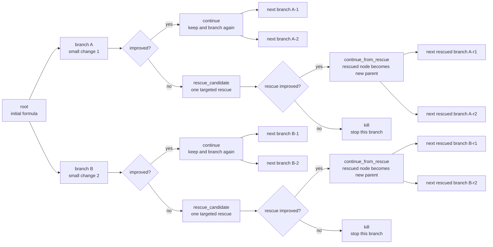
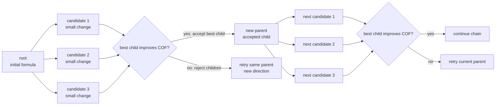
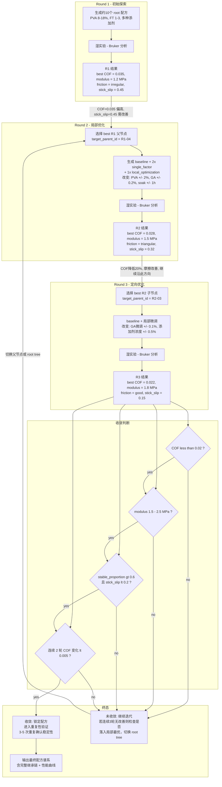

# Project Feasibility Thinking Tree

本文档总结的是"为了让项目更加可行，我们在思路上做了哪些改变"。它不是代码改动清单，而是项目难度降低的逻辑树。

## 一句话概括

原始目标是"让大模型处理实验数据并直接给出下一轮实验材料建议"；现在调整为"让大模型在代码规则和实验约束下，辅助完成下一轮 PVA 水凝胶小步实验规划"。

```text
让项目更加可行
|
+-- 1. 从"开放式材料发现"改为"受约束实验规划"
|   |
|   +-- 原始想法
|   |   +-- 模型读取实验数据
|   |   +-- 模型自由理解材料体系
|   |   +-- 模型自由提出下一轮材料和配方
|   |   +-- 难点：材料空间太大，14B 模型很容易黑盒跳跃
|   |
|   +-- 新想法
|       +-- 固定 PVA 为主体材料
|       +-- 固定摩擦测试条件和基础实验边界
|       +-- 每轮只围绕上一轮父配方小步调整
|       +-- 新材料探索默认关闭或严格限制
|       +-- 项目目标从"发现全局最优材料"降为"形成可解释的局部优化路径"
|
+-- 2. 从"模型直接生成完整配方"改为"代码先生成实验骨架"
|   |
|   +-- 原始想法
|   |   +-- LLM 同时完成数据分析、DOE 设计、配方生成、机制解释
|   |   +-- 难点：单次任务链太长，小模型容易漏字段、乱改变量、编造材料
|   |
|   +-- 新想法
|       +-- 代码先生成 constrained DOE skeleton
|       +-- skeleton 决定：
|       |   +-- 继承哪个父配方
|       |   +-- 属于哪种设计类型
|       |   +-- 允许改变哪些变量
|       |   +-- 如果变好/变差如何解释
|       +-- LLM 只负责解释这个骨架为什么合理
|       +-- 配方主体由代码从父配方复制，而不是让 LLM 从零写
|
+-- 3. 从"追求候选丰富度"改为"追求变量可解释性"
|   |
|   +-- 原始想法
|   |   +-- 每轮生成较多候选
|   |   +-- 尽量覆盖更多材料和工艺组合
|   |   +-- 难点：候选越多，变量越乱，实验结果越难归因
|   |
|   +-- 新想法
|       +-- 默认每轮 4 个候选
|       +-- 优先包含：
|       |   +-- 1 个 baseline_reproduction
|       |   +-- 1-2 个 single_factor_perturbation
|       |   +-- 1 个 local_optimization
|       +-- 每个候选回答一个清楚问题
|       +-- 宁可少做，也要能解释为什么结果变好或变差
|
+-- 3.5 从"线性轮次 DOE"进一步改为"配方优化树"
|   |
|   +-- 当前线性轮次想法
|   |   +-- R1 生成一批候选
|   |   +-- R2 从上一轮表现较好的候选中继续生成一批候选
|   |   +-- 每轮仍然以"整轮候选集合"为主要单位
|   |   +-- 难点：轮次结构清楚，但每条配方路径的生死关系不够直观
|   |
|   +-- 新的树状优化想法
|       +-- 为了文章的数据丰富性，先准备约 10 个初始配方
|       |   +-- 每个初始配方都是一棵独立优化树的 root node
|       |   +-- 不同 root 代表不同初始机制假设或配方区域
|       |   +-- 树与树之间不混合父子关系，避免谱系解释变乱
|       +-- 每次优化只从一个具体配方节点出发
|       +-- 该活跃配方节点生成 2 个或更多子节点
|       |   +-- 每个子节点只代表一个小改动
|       |   +-- 例如改变 PVA 浓度、交联剂浓度、添加剂比例、浸泡时间中的一个
|       +-- 实验后根据性能决定分支命运
|       |   +-- 如果性能提升：保留该分支，并继续从该节点向下分叉
|       |   +-- 如果性能下降：可以直接 kill 该分支
|       |   +-- 或者给该分支一次 rescue chance
|       |       +-- 做一次有针对性的修复改动
|       |       +-- 如果修复后仍无改善，则 kill 该分支
|       +-- 每个节点记录：
|       |   +-- parent_node_id
|       |   +-- changed_variables
|       |   +-- performance_delta
|       |   +-- branch_status: root / pending / continue / rescue_candidate / kill / hold
|       |   +-- action: continue_branch / rescue_once / kill_branch / await_result
|       |   +-- reason: COF improved / COF worsened / rescue attempt failed / manual status
|       +-- 系统维护约 10 棵由不同初始配方启动的配方优化树
|       |   +-- 每棵树代表一个初始配方的局部优化过程
|       |   +-- 每棵树可以对应一个明确机制假设或配方区域
|       |   +-- 每棵树内部做局部搜索和剪枝
|       |   +-- 不同树之间保留有限多样性，避免所有实验都挤到同一个局部最优
|       +-- 当前代码落地方式
|       |   +-- R1 默认可生成约 10 个初始配方 root
|       |   +-- R2+ 可用 --target_parent_id 指定本次只优化一个父配方节点
|       |   +-- 父节点不必来自上一轮；代码会从 R1-04 这类 ID 推断 parent_round_idx
|       |   +-- constrained DOE skeleton 只围绕该父节点生成 baseline repeat 和局部分支
|       |   +-- candidates / inheritance_table / formula_tree.md 记录 tree_id、node_id、parent_node_id、branch_status
|       |   +-- formula_tree.md 根据父子 COF 差异显示 continue、rescue_candidate 或 kill
|       |   +-- formula_branch_decisions.json 记录机器可读的分支状态、action、dCOF 和 reason
|       |   +-- 如果 target_parent_id 已经是 kill，代码拒绝继续展开该分支
|       +-- 项目目标从"每轮生成一批好候选"进一步变为：
|           +-- 维护若干条可追踪的配方演化路径
|           +-- 用实验反馈不断扩展、保留、抢救或剪掉分支
|           +-- 最后得到少数几条有证据支撑的高性能配方谱系
|
+-- 4. 从"模型自己遵守规则"改为"代码强制执行规则"
|   |
|   +-- 原始想法
|   |   +-- 在 prompt 里告诉模型不要乱跳
|   |   +-- 让模型自己记住 parent、baseline、变量数量限制
|   |   +-- 难点：14B 模型不稳定，prompt 不能保证硬约束
|   |
|   +-- 新想法
|       +-- 关键规则全部下沉到代码
|       +-- 代码检查：
|       |   +-- parent_candidate_id 是否有效
|       |   +-- baseline 是否完全复制父配方
|       |   +-- changed_variables 是否超过限制
|       |   +-- 是否仍然是 PVA 主体系
|       |   +-- limited_exploration 是否超量
|       |   +-- 是否发生黑盒跳跃
|       +-- 模型可以犯错，但最终输出必须被代码纠偏或标记
|
+-- 5. 从"看起来科学"改为"实验后能判断"
|   |
|   +-- 原始想法
|   |   +-- 候选配方有机制解释
|   |   +-- 看起来可能降低摩擦
|   |   +-- 难点：解释可能很漂亮，但实验后不知道该怎么决策
|   |
|   +-- 新想法
|       +-- 每个候选必须有 if_better / if_worse
|       +-- 如果结果变好：
|       |   +-- 支持哪个变量或机制
|       |   +-- 下一轮应该沿哪个方向继续
|       +-- 如果结果变差：
|           +-- 否定哪个假设
|           +-- 下一轮应该恢复或换哪个变量
|       +-- 每轮实验不仅是"试配方"，而是回答一个明确问题
|
+-- 6. 从"失败就是失败"改为"失败也要结构化"
|   |
|   +-- 原始想法
|   |   +-- 审计不通过、实验不理想、凝胶失败容易混在一起
|   |   +-- 难点：模型可能把 JSON 字段缺失误判为实验失败
|   |
|   +-- 新想法
|       +-- 分开记录 audit_status 和 experimental_status
|       +-- audit failure:
|       |   +-- 记录格式不完整
|       |   +-- 材料字段不合规
|       |   +-- 规则检查没过
|       +-- experimental failure:
|           +-- 凝胶不成型
|           +-- COF 过高
|           +-- 磨损严重
|           +-- 摩擦曲线异常
|       +-- 有真实 COF 数据的候选，不能仅因审计失败就说成凝胶失败
|
+-- 7. 从"让模型记住历史"改为"用文件记录历史"
|   |
|   +-- 原始想法
|   |   +-- 依赖 prompt 把历史实验讲给模型
|   |   +-- 依赖模型自己保持多轮连续性
|   |   +-- 难点：轮次越多，信息越容易丢失或变形
|   |
|   +-- 新想法
|       +-- 每轮写结构化文件
|       +-- 每轮写继承关系表
|       +-- 每轮写 KPI 日志
|       +-- 下一轮从文件读取父配方和实验结果
|       +-- 让"记忆"成为可检查的数据，而不是模型脑内上下文
|       +-- 如果采用配方优化树：
|           +-- 每个节点和分支状态也必须写入结构化文件
|           +-- 不只记录 round_id，还要记录 tree_id / node_id / parent_node_id
|           +-- kill / rescue / promote 的原因要能回溯到真实实验指标
|
+-- 7.5 从"用户自己判断下一步"改为"运行工作区告诉用户下一步"
|   |
|   +-- 原始问题
|   |   +-- 用户有 R1 配方、CSV、模量数据，但不知道下一步该跑 build_results、diagnose 还是 generate
|   |   +-- 旧 R2 文件可能被误用
|   |   +-- 输入目录和输出目录容易混淆
|   |
|   +-- 新想法
|       +-- 用 RunWorkspace 集中管理轮次文件
|       +-- 用 --status 查看每轮状态和下一步建议
|       +-- 用 --sync_results 简化实验结果回填
|       +-- 用 --regenerate_round --archive_old 安全替换旧轮次输出
|       +-- 让项目不只是"能跑"，而是"知道该怎么跑"
|
+-- 8. 从"证明模型很聪明"改为"证明系统可用"
    |
    +-- 原始想法
    |   +-- 重点证明 14B 模型能独立完成材料优化
    |   +-- 难点：这个目标过高，也不符合有限湿实验预算
    |
    +-- 新想法
        +-- 重点证明人、规则、模型、实验数据可以协同
        +-- 模型负责：
        |   +-- 总结实验现象
        |   +-- 提出机制假设
        |   +-- 写解释和报告
        +-- 代码负责：
        |   +-- 继承关系
        |   +-- 变量限制
        |   +-- 材料白名单
        |   +-- 审计和风险标记
        +-- 实验负责：
            +-- 提供真实反馈
            +-- 验证或否定假设
            +-- 推动下一轮小步决策
```

## 手绘树状优化逻辑的 Markdown 版本

这张图对应用户手绘草图的核心语义：从一个 root 配方出发，每次生成两个或更多局部分支；实验后按性能变化决定继续、救援一次或终止。



## 链式贪心搜索的 Markdown 版本

树状图保留了多条可能路线，适合展示配方谱系；但如果目标是做 `bare base` 与 `SFT+RAG` 的湿实验对比，链式贪心搜索更容易控制实验数量。链式搜索仍然从 root 出发，但每一轮只把“已测 child 中 COF 改善最好的一个”接受为下一轮 parent；如果没有 child 比 parent 更好，就停留在当前 parent，下一轮重新尝试方向。



### 树状搜索与链式搜索的实验数量差别

两者最大的区别是实验数量随轮次增长的方式不同。

| 搜索方式 | 实验数量增长 | 适合目的 | 风险 |
|----------|--------------|----------|------|
| 全展开树状搜索 | 近似指数增长：`root_count * (k + k^2 + ... + k^depth)` | 尽量保留多条配方路线，适合探索配方空间 | 湿实验数量很快失控 |
| 受限树状搜索 | 近似线性增长：每轮只展开一个指定 parent，`rounds * k` | 保留树状谱系，同时控制预算 | 需要人工或规则选择 parent |
| 单候选链式搜索 | 线性增长：`root_count * groups * steps` | 最省实验量，适合严格模型对比 | 每步探索太窄，容易错过更好方向 |
| 多候选贪心链式搜索 | 线性增长：`root_count * groups * steps * k` | 当前代码兼容的模式；每步比较 k 个小改动后只接受最优 child | 比单候选链多做实验，但仍远少于全展开树 |

例如，若 `root_count=5`、`groups=2`、`steps=10`：

- 单候选链式搜索：`5 * 2 * 10 = 100` 次湿实验；
- 每步 3 个候选的贪心链式搜索：`5 * 2 * 10 * 3 = 300` 次湿实验；
- 若全展开树状搜索且每个节点 3 个 child、深度 10，理论节点数接近 `5 * 2 * (3 + 3^2 + ... + 3^10)`，湿实验数量不可接受。

因此，论文验证阶段推荐使用链式搜索或受限树状搜索，而不是全展开树。树状结构负责记录谱系和因果解释；链式搜索负责把湿实验预算压到可执行范围内，并让两组模型在相同 root、相同步数、相同接受规则下公平比较。

## 多轮迭代与收敛过程

上面展示的是单棵树内部的**分支逻辑**（continue / rescue / kill）。下面这张图展示整个优化在**多轮时间轴上的收敛过程**——即 COF 和模量如何随着迭代轮次逐步逼近目标区间，以及每一轮实验后系统如何根据指标变化决定下一步方向。



### 收敛标准

| 指标                             | 目标值                | 判断逻辑                              |
| -------------------------------- | --------------------- | ------------------------------------- |
| COF (稳态摩擦系数)               | ≤ 0.02               | 主指标，越低越好                      |
| compression_modulus (压缩模量)   | 1.5–2.5 MPa          | 太软(<0.5)无法承载，太硬(>2.5)摩擦高  |
| stable_proportion (稳定平台占比) | > 0.6                 | 摩擦曲线质量，>0.6 表示稳态滑动占主导 |
| stick_slip_score (粘滑评分)      | < 0.2                 | 高频振荡能量占比，<0.2 表示无明显粘滑 |
| COF 收敛趋势                     | 连续2轮 ΔCOF < 0.005 | 改善已趋于平缓，继续小步迭代收益递减  |

### 库存约束指标

湿实验排期不仅受样品数量影响，也受药品是否已有库存影响。为了避免模型生成“理论上合理但需要等待采购”的配方，湿实验评估中加入库存约束指标。库存来源默认是 `cycle/materials/materials_en.csv`，也可以通过 `wetlab_metrics.py --inventory-csv <csv>` 指定自己的药品名单。

| 指标 | 计算方法 | 判断的问题 |
|------|----------|------------|
| `inventory_hit_rate` | 候选中所有非基础材料都在库存 CSV 中的比例 | 生成结果是否主要使用现有药品 |
| `new_material_rate` | 相对 parent 引入新非基础材料的候选比例 | 模型是否频繁跳出小步优化和库存约束 |
| `purchase_blocked_rate` | 候选中存在库存外材料的比例 | 实验是否可能因为采购而被阻塞 |
| `inventory_constrained_success_rate` | 库存内候选中制备成功且有有效 COF 的比例 | 在真实库存约束下，方案是否仍然可执行 |

这里的基础材料如 PVA 和 DI water 不计为新材料。该指标组让项目从“模型推荐配方”进一步收缩为“模型推荐实验室当前能连续执行的配方”，降低湿实验被采购周期打断的风险。

### 迭代过程中的典型场景

```text
场景 A：单调收敛（理想路径）
R1: COF=0.045 → R2: COF=0.032 → R3: COF=0.022 → R4: COF=0.018 ✅ 收敛
    每轮都在改善，第4轮达到目标。直接进入重复性验证。

场景 B：先改善后停滞
R1: COF=0.040 → R2: COF=0.028 → R3: COF=0.026 → R4: COF=0.027 ⚠️ 停滞
    R2-R4 连续3轮 ΔCOF<0.005。可能落入局部最优 → 切换 root tree 或引入新添加剂。

场景 C：恶化后 rescue
R1: COF=0.035 → R2: COF=0.025 → R3: COF=0.038 ❌ 恶化
    R3 性能下降 → rescue_candidate: 回退到 R2 配方 + 单变量修复
    → rescue 成功: COF=0.023 ✅ 从 rescue 节点继续
    → rescue 失败: COF=0.040 → kill 该分支

场景 D：系统性摩擦问题
R1: 全部 8 个候选 friction_pattern=irregular, stick_slip>0.5
    → 不是某个配方的问题，是测试条件或基础材料体系的问题
    → 检查 Bruker 对中、DI水温度、PVA 分子量、溶解工艺
    → 调整后重新开始 R1
```

对应到当前代码：

- `formula_tree.md` 用人可读形式展示这棵树；
- `formula_branch_decisions.json` 用机器可读形式记录每个节点的 `branch_status`、`action`、`reason` 和 `delta_cof`；
- `branch_status=continue` 表示这条路线可继续展开；
- `branch_status=rescue_candidate` 表示该路线变差，但可以给一次 rescue chance；
- rescue 成功后，不回到原来的 continue 节点，而是把 rescue 成功的节点作为新的父节点继续展开；
- `branch_status=kill` 表示该路线不再继续展开，`--target_parent_id` 指向该节点时会被代码拒绝。

## 3.6 从"独立树"进一步改为"树间统计学习"

配方优化树不应该退化成 10 次彼此独立、互不学习的重复实验。更合适的结构是：

```text
单棵树内部：
    只从一个 parent node 出发
    只评价当前局部改动
    保持清楚的因果继承路径

多棵树之间：
    共享统计知识
    共享失败经验
    共享 rescue 是否有效的证据
    但不共享 parent_candidate_id
```

因此，建第 5 棵树时，系统可以知道前 4 棵树中哪些变量改动更可能让 COF 下降、哪些改动更容易触发 kill、哪些 rescue 策略成功率较高、哪些 root tree 更有前途。这些知识作为统计先验注入 Agent 和 generator，但不会让第 5 棵树的候选去继承第 1 棵树的父节点。

当前代码对应为：

- `tree_statistics.json`：机器可读统计，包括变量效果、tree ranking、rescue_success_rate、kill_rate；
- `tree_statistics.md`：人可读跨树统计报告；
- `tree_memory_cards.jsonl`：可检索统计记忆卡片；
- `build_tree_statistics_context()`：把统计结果压缩成 prompt/RAG 上下文；
- Audit Agent 与普通 generator prompt 会注入这段统计记忆。

## 3.7 从树状分支进一步兼容链式贪心搜索

树状优化适合保留多条候选路线，但湿实验对比需要更清楚、更省实验量的主线。因此在不删除树状工作流的前提下，增加一个可选的链式贪心搜索模式：

```text
原来的树状模式：
    一个 root 可以产生多个分支
    分支根据 COF 变化被 continue / rescue / kill
    适合探索和保留配方谱系

新增的链式贪心模式：
    从一个指定 root 出发
    每轮只接受 COF 改善最好的 child
    若没有 child 改善，则停留在当前 parent，下一轮重新尝试方向
    形成 root -> accepted child -> accepted child 的单链
```

这一步降低了湿实验验证难度：

- 每个 root 得到一条可比较的连续优化轨迹；
- `bare base` 与 `SFT+RAG` 可以在相同 root、相同步数、相同接受规则下比较；
- 评价重点从“生成很多看起来合理的分支”变为“是否持续推动实验性能改善”；
- 链路上的每一步都有明确 parent、child、COF delta 和接受/拒绝记录。

当前代码对应为：

- `chain_search.py`：实现 `resolve_chain_parent()`，按 COF 选择当前贪心 parent；
- CLI 参数 `--chain_search`：启用链式模式；
- CLI 参数 `--chain_root_id`：指定链式搜索从哪个 root 出发；
- CLI 参数 `--chain_accept_delta`：定义接受 child 的 COF 改善阈值；
- `chain_search_state.json`：记录 root、current_parent、trace、delta_cof 和 accept/reject 决策；
- 若不开启 `--chain_search`，原有树状优化与 `--target_parent_id` 仍保持兼容。

## 3.8 从仅靠项目内实验记忆进一步增加外部 formulation RAG

项目原先主要依赖当前 run 的实验结果、树统计记忆和模型自身知识。为了让下一轮建议更有文献支撑，现在增加外部结构化 formulation RAG：

```text
文献层：
    PDF / Markdown 文献
    -> formulation optimization cases
    -> agent-reviewed SQLite RAG database

检索层：
    根据材料、问题、性能目标检索相关案例
    返回 baseline、optimized formulation、changed factor、mechanism、tradeoff、source locator

生成层：
    R1 generator / R2+ generator / Audit Agent / Formula Agent / Diagnosis
    在 prompt 中注入 formulation literature context
```

这一步解决的是“模型提出的小步改动是否有文献先验”的问题。RAG 不直接替代代码规则，也不直接决定配方；它提供可追溯的外部证据，让模型在受约束 DOE skeleton 内解释和选择更合理的方向。

当前代码和数据对应为：

- 默认数据库：`数据库/formulation_optimization_cases_agent_reviewed/formulation_rag_agent_reviewed.sqlite`；
- 默认规模：671 条 agent-reviewed cases，68 篇论文；
- `formulation_rag.py`：把外部 formulation RAG 渲染成 prompt context；
- `generator.py`：R1/R2+ 生成阶段可注入 RAG；
- `pipeline_agents.py`：Audit Agent 与 Formula Agent 可注入 RAG；
- `workflow.py`：diagnosis 阶段可注入 RAG；
- CLI 参数 `--formulation_rag_db`：指定 RAG 数据库；
- CLI 参数 `--disable_formulation_rag`：关闭外部 formulation RAG。

## 难度变化

```text
原始难度：9/10
|
+-- 原因
|   +-- 开放材料空间
|   +-- 多目标优化
|   +-- 小样本湿实验
|   +-- 14B 模型要承担完整推理链
|   +-- 配方生成和实验判断强耦合
|
+-- 调整后难度：5.5-6.5/10
    |
    +-- 原因
        +-- 固定 PVA 主体系
        +-- 每轮候选减少到 4 个左右
        +-- 每个候选只改 0-2 个变量
        +-- 配方继承由代码保证
        +-- baseline 由代码复制
        +-- LLM 主要做解释和报告
        +-- 每轮输出可审计继承表

+-- 树状优化后的难度：5.0-6.0/10
    |
    +-- 原因
        +-- 每个实验节点只回答一个局部改动是否有用
        +-- 分支保留和剪枝规则比整轮自由规划更清楚
        +-- 失败分支可以被及时 kill，减少湿实验预算浪费
        +-- rescue chance 允许对接近成功的分支做一次修复，而不是过早丢弃
        +-- 10 个左右初始配方各自展开局部优化树，既提供文章所需的数据丰富性，也避免开放式材料空间失控
```

## 最核心的思路转变

```text
不是：
让模型像材料科学家一样自由发明下一轮配方

而是：
让模型像实验助手一样，在代码给定的安全边界内解释数据、提出假设、辅助选择下一步小实验

进一步可以是：
让系统像一个受约束的配方进化树管理器，从约 10 个初始配方分别出发；每次只优化一个具体配方节点，持续扩展有希望的分支，抢救边缘分支，剪掉无效分支
```

## 树状优化运行方式

```bash
# 1. 生成约 10 个初始 root 配方
python -m pva_work_flow.cli --engine mock --mode generate --round 1 --tree_initial_roots 10 --out_dir run_tree

# 2. 对某一个 root / 当前活跃节点做一次局部分叉
#    n_candidates 包含 1 个 baseline_reproduction 和若干局部分支
python -m pva_work_flow.cli --engine mock --mode generate --round 2 --target_parent_id R1-04 --n_candidates 3 --out_dir run_tree
```

这个命令语义是：R2 不再尝试覆盖上一轮所有父配方，而是只从 `R1-04` 这个节点出发，生成该节点的局部优化子节点。若要优化另一棵树，可以在后续操作轮次继续指定另一个 `--target_parent_id`；例如 `--round 3 --target_parent_id R1-07` 会回到 R1 的 `R1-07` root 继续展开它自己的树。

## 链式搜索与 RAG 运行方式

```bash
# 链式贪心搜索：从指定 root 出发，自动选择当前 accepted parent
python -m pva_work_flow.cli \
  --engine mock \
  --mode full \
  --rounds 3 \
  --tree_initial_roots 3 \
  --n_candidates 3 \
  --n_select 3 \
  --simulate_results \
  --chain_search \
  --chain_root_id R1-01 \
  --out_dir run_chain

# 使用外部 formulation RAG 数据库
python -m pva_work_flow.cli \
  --engine mock \
  --mode full \
  --rounds 2 \
  --formulation_rag_db 数据库/formulation_optimization_cases_agent_reviewed/formulation_rag_agent_reviewed.sqlite \
  --out_dir run_with_rag

# 如需做 bare base 对照，可关闭 formulation RAG
python -m pva_work_flow.cli \
  --engine mock \
  --mode full \
  --rounds 2 \
  --disable_formulation_rag \
  --out_dir run_without_rag
```

链式搜索输出 `chain_search_state.json`，用于记录每一步的 `parent_id`、`best_child_id`、`delta_cof` 和 accept/reject 决策。湿实验结束后，可以用 `wetlab_metrics.py` 读取这些状态文件和 `R*_results_filled.csv`，计算模型对比指标。
