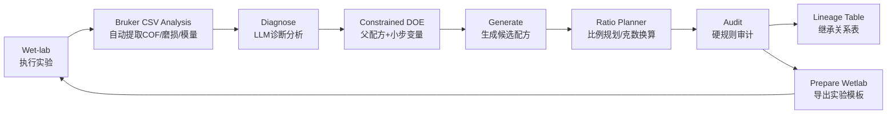
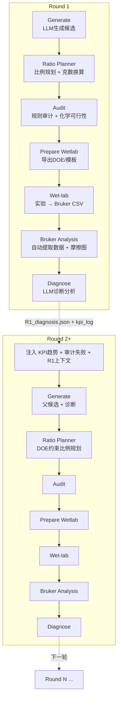
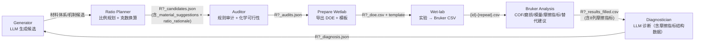

# PVA 水凝胶迭代优化工作流概述

## 一、项目目标

该项目是一个 **PVA 水凝胶受约束闭环实验规划系统**。它不是让 14B 模型自主完成开放式材料发现，而是让 LLM 在固定测试条件、材料白名单、父配方继承、规则审计和小步 DOE 模板约束下，辅助完成实验数据解释和下一轮配方建议。

一句话概括：

> 用大模型处理数据，并在规则约束下给出下一轮小步迭代实验材料与配方建议。

当前论文主线采用“配方优化树”：R1 先生成约 10 个独立初始 root 配方；R2+ 每次通过 `--target_parent_id` 只从一个已完成配方节点出发，生成 baseline repeat 和 2 个或更多局部分支。性能提升的分支保留，性能下降的分支可进入一次 rescue 尝试；若仍未改善，则将该分支标记为 kill/停止扩展。数据丰富性来自约 10 棵独立优化树，而不是同一次生成混用多个父配方。

同时，系统不让每棵树彼此失忆。树内仍然坚持单父节点局部优化；树间通过 `tree_statistics.py` 共享统计知识，包括变量改动的 improvement_rate、mean_delta_cof、kill_rate、rescue_success_rate 和 root tree 排名。这样第 5 棵树可以参考前 4 棵树已经学到的统计先验，但不会破坏单棵树内部清晰的父子继承关系。

在固定测试条件下（10 N / 不锈钢球 / DI水 / 25°C / 5 mm/s），系统完成以下循环：



每轮的目标不是“自由发明新体系”，而是围绕 PVA 主体系识别 2-3 个关键有效变量，并通过可解释的小步迭代降低稳态摩擦系数（COF）和磨损，避免剥离/碎屑，减少粘滑波动。

---

## 二、系统特点与优势

### 2.1 核心特点

| 特点 | 说明 |
|------|------|
| **防 LLM 异想天开架构** | 见下方"LLM 约束体系"专节——结构化数据注入 + 化学体系连续性校验 + 代码层 DOE 构建 + 比例规划器 DOE 锚定，四道防线确保 LLM 不凭空捏造配方 |
| **配方比例规划器** | LLM 先提出材料体系与机制，`ratio_planner.py` 再按材料角色、DOE 因子和诊断意图给出可解释 wt% / 20 g batch 克数，并写入 `ratio_rationale` |
| **小样本优化策略** | 当前主线每次只展开一个父配方节点；同一节点下控制 1-2 个活跃变量，生成 baseline repeat + 小步分支，跨约 10 个 root 配方形成多棵优化树 |
| **跨树统计学习** | `tree_statistics.json/md` 和 `tree_memory_cards.jsonl` 将多棵树的结果压缩为统计 RAG，让后续树参考历史变量效果和失败频率 |
| **全自动实验数据提取** | 直接读取 Bruker UMT 原始 CSV，自动计算 COF 均值/标准差、摩擦耗散能(wear_proxy)、压缩模量；无需人工计算填表 |
| **摩擦模式智能判别** | 施密特触发器零交点检测 + 五模式分类（良好/三角往复/粘滑/不对称/混乱），每候选自动生成 Fx-T 分析图 |
| **结构化摩擦指标** | 每个候选产出的 plateau_ratio、asymmetry、cv_amplitude、stick_slip_score、stable_proportion 全部注入 LLM 诊断 |
| **化学可行性硬审计** | 9 条硬规则（PVA溶解温度、戊二醛需HCl、硼砂pH敏感性、UV固化填料透明度、PEG沥出、双交联合理性、离子冲突、冻融PVA专属性、占位符材料名拦截）自动拦截不可行配方 |
| **材料库存智能匹配** | 从 336 种实验室化学品清单中，按角色+官能团+名称相似度，为 LLM 提出的不在库材料自动推荐替代品，标注写入 JSON |
| **代码层自动修正** | 自动将 LLM 产出的不合理数值修正到安全范围（soak≤4h、FT≤3、cycle_h≤2），清除占位符材料名（"None"、"Polymer A"） |
| **迭代上下文强化** | 生成器同时看到：KPI趋势（COF升降告警）、审计失败原因清单（"不要重复这些错误"）、R1原始诊断（防信息衰减） |
| **连续失败自动重置** | R3+ 检测到连续审计失败时，自动触发 RESET 模式，从 R1 最佳候选重新探索 |
| **一键批量处理** | `--build_results <总目录>` 自动扫描 Rn/ 子目录和 Rn_compression/ 配对，一次性处理所有轮次 |

### 2.2 受约束 DOE 规则层（v2.2）

为了降低 14B 模型承担的任务难度，当前版本新增 `candidate_rules.py`，把最容易出错的实验规划约束移到代码层执行。

| 规则 | 当前实现 |
|------|----------|
| 父配方继承 | R2 及之后每个候选必须有有效 `parent_candidate_id` |
| baseline 完全复现 | `baseline_reproduction` 由代码复制父配方，任何材料、浓度、工艺参数变化都会被标记 |
| 变量变化检测 | 系统自动比较父/子配方并写入 `changed_variables` |
| 变量数量限制 | `local_optimization` 最多 2 个变量；`single_factor_perturbation` 必须 1 个变量；`failure_verification` 最多 1 个变量 |
| 有限探索限制 | 每轮最多 1 个 `limited_exploration`，且必须保留 PVA 主体系 |
| PVA 主体系 | 所有候选必须包含 PVA 主聚合物，除非人工显式覆盖 |
| 失败类型区分 | `audit_status` 表示规则/格式审计；`experimental_status` 表示湿实验结果，二者不混用 |
| 黑盒跳跃评分 | `black_box_jump_score >= 4` 视为高风险，应拒绝或人工复核 |
| 继承表输出 | 每轮写入 `inheritance_table`，并导出 `R{r}_inheritance_table.md` |

这层规则的目的不是替代 LLM，而是把 LLM 从“自由发明配方”的角色降维为“解释受约束 DOE skeleton、补充假设和报告”的角色。

### 2.3 相比手动流程的优势

| 维度 | 手动流程 | 本系统 |
|------|---------|--------|
| 实验数据处理 | 打开每个 Bruker CSV → 手动算 COF | 一条命令，自动提取所有轮次 |
| 摩擦质量判断 | 肉眼逐条看曲线 | 自动判别 + 生成 5 模式标注图 |
| 配方安全检查 | 凭经验判断 | 8 条化学硬规则 + 占位符拦截 |
| 材料替换建议 | 查手册/凭经验 | 按角色+官能团自动推荐替代品 |
| 迭代方向 | 人工判断 | KPI 趋势告警 + 审计失败清单引导 |
| 从实验到诊断 | 手动填 CSV → 手动跑诊断 | Bruker CSV → results_filled → diagnosis 全自动 |

### 2.3 LLM 约束体系：如何防止模型异想天开

LLM 生成候选配方时最大的问题是**把每一轮当成独立头脑风暴**——读到上一轮诊断摘要后，凭空想出全新的材料体系和配方，而不是在已有实验基础上做受控迭代。本系统通过**四道防线**解决这个问题。

#### 第一道防线：结构化数据注入（生成阶段）

LLM 不再仅靠一段"诊断摘要"做决策。生成 prompt 前端注入三张硬数据表：

```
┌─────────────────────────────────────────────┐
│ === R1 实验结果（真实数据，以此为据）===      │
│ ID     COF    摩擦模式   磨损   模量    …    │
│ R1-01  0.029  irregular  38.8   1.78        │
│ R1-02  0.031  irregular  12.3   -           │
│ …                                           │
│                                              │
│ === 父本配方（继承这些化学体系）===           │
│ R1-04: PVA=12%, network=chemical/ga_hcl,    │
│        additives=[CMC 1.0%, GA 1.0%, …]     │
│                                              │
│ === DOE 边界（只能从这里选）===               │
│ pva_wt_percent: [8.0, 10.0, 12.0] ← 选一个  │
│ additive_type: [HA, CMC, DMSO, Mucin]       │
│ freeze_thaw_cycles: [0, 1, 2]               │
│                                              │
│ === 允许材料（不要发明新材料）===             │
│ PVA, DMSO, Sodium Hyaluronate, CMC,         │
│ Glutaraldehyde, HCl, Borax, DI water, …     │
└─────────────────────────────────────────────┘
```

效果：LLM 看到的是精确数字和硬边界，而不是一段模糊的自由文本。无法编造"μ=0.08, wear=0.02 mm³/N·m"这种幻觉数据——因为真数据就在上面。

#### 第二道防线：化学体系连续性校验（审计阶段）

每个候选与其父本比较"化学指纹"（network_type + crosslinker + method）。指纹不同且未标记 `is_extension=true` 的候选直接被拦截：

```
父本 R1-03: chemical | ga_hcl_fast | none（戊二醛化学交联）
子本 R2-XX: physical | freeze-thaw | none（物理冻融）
          → FAIL: chemistry_lineage_broken
          → 要切换体系？必须 is_extension=true + 写理由
```

同时，基线材料（PVA、DI water、none）自动豁免"新材料"检查；`allow_extension=true` 时整项检查跳过。这确保 LLM 的探索被限制在有意义的增量改进范围内，而非每次"重新发明"配方。

#### 第三道防线：代码层 DOE 因子构建（诊断阶段）

诊断 LLM 只负责分析数据、提出优化假设。**DOE 因子的具体定义由代码接管**：

```
诊断 LLM 输出:                           代码层接管:
  actionable_levers:                     _LEVER_TO_DOE 映射表:
    - lever: "pva_wt_percent"    →       pva_wt_percent: [8.0, 10.0, 12.0]
    - lever: "additive_type"     →       additive_type: [HA, CMC, DMSO, Mucin]
    - lever: "freeze_thaw"       →       freeze_thaw_cycles: [0, 1, 2]
    - lever: "crosslinker"       →       crosslinker_concentration: [low, medium, high]
```

好处：因子名永远是 snake_case，范围从 `ROLE_RANGES` 预定义表中读取，不会出现 "Additive Combination" vs "additive_combination" 的命名漂移。未识别的 lever 保留 LLM 原始定义作为兜底。

#### 第四道防线：比例规划器 DOE 锚定（比例规划阶段）

`ratio_planner.py` 不仅计算 wt%，还直接从 `doe_factor_levels` 读取锚点：

| DOE 因子 | 读取方式 | 效果 |
|----------|---------|------|
| `pva_wt_percent` | 硬锚点，直接使用 | LLM 写 12.0 → PVA 就是 12.0% |
| `crosslinker_concentration` | `low/medium/high` → 映射到具体 wt% 范围 | "medium" → LHS 采样于 0.3-0.6% |
| `additive_type` | 配方中无添加剂时自动注入 | LLM 声明但忘写配方 → 代码补上 |
| 方向关键词 | `reduce_brittleness` → 塑化剂下限提高 | 文本意图 → 数值约束 |

LLM 写在 `doe_factor_levels` 里的声明不再是"装饰性文本"——它真的驱动了具体克数计算。

#### 四道防线的协同效果

```
LLM 自由生成
    │
    ├── 数据注入：看到的是真数据表，不是摘要 → 编不出幻觉数据
    ├── 体系校验：换交联体系必须声明 extension → 跳不出化学路线
    ├── DOE 代码化：因子名和范围由代码定义 → 不会命名漂移
    └── 比例锚定：DOE 声明驱动实际计算 → 写的和算的一致
```

---

### 2.4 3-Agent 流水线架构（v2.0 核心升级）

#### 设计动机

旧架构（v1.x）的 R2+ 生成流程是**单 LLM 调用**：将 R1 数据、诊断摘要、DOE 边界、材料列表、化学约束、JSON schema 全部塞进一个巨大 prompt，让 LLM 一次性完成"分析数据 → 设计实验 → 书写配方"三件事。

这带来了三个根本问题：

| 问题 | 表现 |
|------|------|
| **上下文过载** | ~19KB prompt，14B 模型注意力被分散，常忽略关键数据 |
| **推理黑盒** | 结果不好时，无法判断是审计错了、规划错了、还是书写错了 |
| **约束靠"劝"** | 写"不要引入新材料"靠文本指令，LLM 自由度太大 |

新架构遵循 `steps.md` 将 R2+ 生成拆为**三个独立的 Agent**，每个 Agent 有独立的 system prompt、独立输入输出和单一认知任务。

#### 架构对比

```
旧架构（单 Agent）:
┌────────────────────────── 19KB context ──────────────────────────┐
│ System: GEN_PROMPT_RN                                            │
│ Input: R1 结果表 + 父本配方 + DOE + 材料列表 + JSON schema + …   │
│ Task:  同时完成 数据分析 + 实验设计 + 配方书写                    │
│ Output: R2_candidates.json                                       │
└──────────────────────────────────────────────────────────────────┘
     ↑ 一次 LLM 调用，三件事挤在一个上下文窗口里
     ↑ 中间无产物，出错只能靠最终配方反推原因

新架构（3-Agent）:
┌────────── 10KB ──────────┐   ┌────────── 5KB ──────────┐   ┌────────── 4KB ──────────┐
│ Agent 1: 审计 Agent       │   │ Agent 2: DOE 规划 Agent  │   │ Agent 3: 配方生成 Agent  │
│                          │   │                          │   │                          │
│ System: AUDIT_AGENT      │   │ System: DOE_PLANNING     │   │ System: FORMULA_AGENT     │
│ Input: R1 配方+结果      │→  │ Input: 审计输出           │→  │ Input: 继承关系表          │
│ Task:  找规律、评优劣    │   │ Task:  设计实验结构       │   │ Task:  写可执行配方        │
│                          │   │                          │   │                          │
│ Output: audit_agent.json │   │ Gate: inner_rules 4条件   │   │ Gate: self-review 10题     │
│         ↓ 落盘可查       │   │       risk≥4 拒绝         │   │       变量不得超出表范围    │
│                          │   │ Output: doe_plan.json     │   │ Output: candidates.json    │
└──────────────────────────┘   └──────────────────────────┘   └──────────────────────────┘
     ↑ 三次独立 LLM 调用，串行执行，每次上下文"满血"聚焦单一任务
     ↑ 两个中间产物落盘，每一步都可以暂停审查
```

#### 核心优势

**A. 上下文隔离，推理质量更高**

每个 Agent 只看到自己需要的信息——审计 Agent 不懂 DOE 规划，配方 Agent 不知道 R1 原始数据长什么样（只知道继承表里声明了什么）。每个 Agent 的上下文窗口几乎是"空的"，LLM 的全部注意力可以聚焦在单一任务上。对于 14B 这种规模较小的模型尤其重要：上下文越长，推理质量衰退越快。三个小 prompt 的推理质量之和，远高于一个超大 prompt。

**B. 中间产物可审查**

| 产物 | 审查内容 |
|------|------|
| `R2_audit_agent.json` | 最佳/失败配方判断是否合理？变量方向是否正确？ |
| `R2_doe_plan.json` | 继承关系表是否合理？black_box_risk 评分是否准确？ |
| `R2_candidates.json` | 配方是否严格遵循继承表？self-review 是否诚实？ |

如果最终配方有问题，可以精确追溯到哪一步出错，而不是面对一个黑盒。

**C. 约束从"劝"变"锁"**

旧架构靠 prompt 文本"建议"LLM 遵守规则（"请不要引入新材料"）。新架构在 Agent 2 输出继承表后，Agent 3 被 schema 锁死——不能输出表中未声明的变量。加上代码层的 `inner_rules` 4 条件门控和 `black_box_risk ≥ 4` 硬拒绝，LLM 的自由度被结构化地限制在合理范围内。

**D. 资源开销对比**

| 维度 | 旧架构 | 新架构 |
|------|--------|--------|
| LLM 调用次数 | 1 次 | 3 次（串行） |
| 峰值上下文 | ~19KB | ~10KB（更低） |
| 单次推理注意力 | 分散于 3 个任务 | 聚焦于 1 个任务 |
| GPU 显存峰值 | 相同 | **更低** |
| 总耗时 | 1× | ~3×（串行三次） |
| 中间产物 | 无 | audit + doe_plan + candidates |
| 错误可追溯性 | 黑盒 | 精确到 Agent |

**唯一的额外成本是时间**——串行调三次比一次慢约 3 倍。但换来的是可审查性、可复现性和推理质量的大幅提升，这个 trade-off 在科学实验设计场景下是完全值得的。

#### 调用流程

```
scripts/pva_vllm.sh --regenerate 2
  └─ cli.py → run_generator(round_idx=2)
       └─ generator.py: 检测 round_idx>1 → 走 3-Agent 流水线
            └─ pipeline_agents.py: run_three_agent_pipeline()
                 │
                 ├─ [LLM 调用 #1] Agent 1 → R2_audit_agent.json
                 │
                 ├─ [LLM 调用 #2] Agent 2 → R2_doe_plan.json
                 │     └─ inner_rules 门控 + risk≥4 拒绝
                 │
                 ├─ [LLM 调用 #3] Agent 3 → raw candidates
                 │     └─ self-review 10题 + 变量范围锁
                 │
                 └─ generator.py 后处理:
                      ratio_planner(20g克数) → normalize → corrections
                      → audit.py → R2_candidates.json + R2_audits.json
```

#### 关键文件

| 文件 | 角色 |
|------|------|
| [prompts/prompts_agents.yaml](../prompts/prompts_agents.yaml) | 三个 Agent 的 system prompt，对齐 `steps.md` 的工作流步骤 |
| [pipeline_agents.py](pipeline_agents.py) | 三步流水线编排 + inner_rules 门控 + risk 校验 + RAG 注入 + Rule Checker + 记忆写入 |
| [generator.py](generator.py) | R1 走旧 prompt，R2+ 自动切换 3-Agent 流水线 + DOE 值归一化 |
| [steps.md](../workflow/steps.md) | R2+ 受限工作流步骤与黑盒跳跃防护规则 |
| [inner_rules.md](../rules/inner_rules.md) | 4 条件门控规则 |
| [steps.md](../workflow/steps.md) | 3 阶段任务定义 |

---

### 2.5 Layer 1+2 增强模块（v2.1）

基于 `hydrogel_agent_optimization_plan.md` 的三层优化计划，第一层（必须做）和第二层（中期增强）已全部实现并集成到流水线。

#### 数据流（完整版）

```
R1 数据
  │
  ├─ [Layer 2.2] RAG 检索历史记忆 → 注入 Agent 1 prompt
  │
  ├─ Agent 1 (Audit)    → R2_audit_agent.json
  ├─ Agent 2 (DOE)      → 生成 2 套 DOE 方案
  │     ├─ [Layer 2.1] Candidate+Critic: 8 维评分 + 硬规则过滤 + 优选
  │     └─ [Layer 1.4] Rule Checker: 10 条规则硬检查
  ├─ Agent 3 (Formula)  → 完整配方 + self-review
  │     └─ ratio_planner → audit.py → R2_candidates.json
  │
  └─ [Layer 1.1 + 2.2] experiment_records.jsonl ← 自动追加
```

#### 新增模块

| 文件 | 层次 | 功能 |
|------|:--:|------|
| [experiment_state.py](experiment_state.py) | Layer 1.1 | `FormulaRecord`/`ExperimentRound` 数据结构、`validate_formula_record()`、`summarize_round()`、pipeline 数据自动转换 |
| [rule_checker.py](rule_checker.py) | Layer 1.4 | 独立 10 条规则检查器（母配方追溯、design_type 分类、变量上限、基线复现、50% 局部优化、失败验证、探索≤25%、材料白名单、黑盒风险≤3、假设完整性），`run_all_rule_checks()` 返回 `{passed, errors, warnings}` |
| [candidate_critic.py](candidate_critic.py) | Layer 2.1 | DOE 多候选生成（2 套）+ Critic LLM 8 维评分（数据利用度、可追溯性、变量控制、假设质量、DOE 结构、失败学习、材料可行、低摩擦对齐）+ `select_best_candidate()` 优选，失败自动回退单套 |
| [experiment_rag.py](experiment_rag.py) | Layer 2.2 | JSONL 实验记忆存储 + 6 种检索（最佳/失败/按变量/按材料/按设计类型/相似目标）+ `build_context_from_retrieval()` 构建 LLM 可读摘要，Agent 1 自动注入历史上下文 |

#### Candidate+Critic 评分体系

| 维度 | 范围 | 说明 |
|------|:--:|------|
| data_usage | 1-5 | 是否充分利用上一轮实验结果 |
| traceability | 1-5 | 每个新配方是否有明确母配方 |
| variable_control | 1-5 | 每个配方最多改 1-2 个关键变量 |
| hypothesis_quality | 1-5 | 假设是否明确可检验 |
| doe_structure | 1-5 | 是否包含基线+局部+单因素+失败验证+探索 |
| failure_learning | 1-5 | 是否吸收上一轮失败配方信息 |
| material_feasibility | 1-5 | 是否符合材料和工艺约束 |
| low_friction_alignment | 1-5 | 是否服务低摩擦 PVA 目标 |

总分 40 分，优选最高分且无硬性错误的方案。

---

## 三、文件结构与职责

| 文件 | 角色 | 职责 |
|------|------|------|
| [cli.py](cli.py) | 主入口/编排器 | 解析命令行参数、初始化LLM引擎、编排多轮工作流、Bruker CSV批量处理 |
| [ratio_planner.py](ratio_planner.py) | 比例规划器 | 根据材料角色、DOE 因子和诊断意图规划 PVA/交联剂/添加剂等 wt%，换算 20 g batch 克数，并生成 `ratio_rationale` |
| [generator.py](generator.py) | 候选生成器 | Prompt构建、LLM候选生成、后处理自动修正（数值/占位符/材料匹配）、迭代上下文注入（KPI趋势+审计失败+R1上下文+R3+重置）、DOE覆盖检查 |
| [workflow.py](workflow.py) | 核心业务逻辑 | Prompt加载、prepare_wetlab、Diagnostician、text-only诊断兜底 |
| [formulation_checks.py](formulation_checks.py) | 配方完整性 | 材料完整性检查、formulation/materials 双向同步、制备时间估算（从 workflow.py 抽出） |
| [budget_manager.py](budget_manager.py) | 预算管理 | 实验计数、4 阶段推断、round shape 推荐、预算告警 |
| [constrained_planning_policy.yaml](constrained_planning_policy.yaml) | 规则单一来源 | design_type 变量限制、black_box 评分规则、PVA 主体系约束、budget 阈值 |
| [audit.py](audit.py) | 审计引擎 | 规则审计 + **化学可行性硬检查**（9条规则）+ **占位符材料名拦截**（9条正则） |
| [llm_engines.py](llm_engines.py) | LLM后端 | MockLLM / TransformersLLM / VllmOpenAIChatLLM |
| [config.py](config.py) | 配置 | 固定测试约束条件、验收标准、BUDGET 预算配置 |
| [io_artifacts.py](io_artifacts.py) | I/O工具 | DOE/模板导出、COF聚合、KPI计算 |
| [utils.py](utils.py) | 通用工具 | JSON读写、安全JSON提取、材料库加载、材料相似匹配（Bruker分析函数从bruker_parser.py重导出） |
| [bruker_parser.py](bruker_parser.py) | Bruker数据解析 | Bruker UMT CSV解析、施密特触发器半周期检测、五模式摩擦判别、压缩模量计算、Fx-T分析图、批量构建results_filled |
| [prompts/prompts_en.yaml](../prompts/prompts_en.yaml) | Prompt模板 | 含完整 JSON 示例、PVA wt%约束(5-20%)、数值硬限制、化学约束、摩擦指标解读指南 |
| [prompts/prompts_agents.yaml](../prompts/prompts_agents.yaml) | Agent Prompt | 三个 Agent 的独立 system prompt，对齐 steps.md + inner_rules.md |
| [pipeline_agents.py](pipeline_agents.py) | 流水线编排 | 3-Agent 串行调用 + RAG 注入 + Candidate+Critic + Rule Checker + 记忆写入；R2+ 受限模式下用代码物化父配方继承，LLM 不再自由写完整配方 |
| [constrained_doe.py](constrained_doe.py) | 受限 DOE | R2+ 默认生成最多 4 个小步继承条目：baseline、单因子扰动、局部优化；默认禁用 limited_exploration |
| [candidate_rules.py](candidate_rules.py) | 受约束规则 | 父配方检查、baseline 完全复现、changed_variables 语义自动检测（含 canonicalize）、limited_exploration 限制、黑盒跳跃评分、继承表输出 |
| [experiment_notes.py](experiment_notes.py) | 实验备注 | 手动填写实验观察（破裂/未成胶等），ERROR1-10 错误码系统，自动注入诊断 prompt |
| [experiment_errors.yaml](experiment_errors.yaml) | 错误码定义 | 10 种标准错误码（破裂、未成胶、过软、表面损伤等），含 severity/impact/suggested_action |
| [experiment_state.py](experiment_state.py) | 实验状态 | Layer 1.1：结构化实验数据模型、验证、摘要、pipeline 自动转换 |
| [rule_checker.py](rule_checker.py) | 规则检查 | Layer 1.4：10 条硬规则独立检查器，DOE 输出后自动运行 |
| [candidate_critic.py](candidate_critic.py) | 候选评审 | Layer 2.1：多 DOE 生成 + Critic 8 维评分 + 优选 |
| [experiment_rag.py](experiment_rag.py) | 实验记忆 | Layer 2.2：JSONL 持久化 + 6 种检索 + LLM 上下文构建 |
| [simulation.py](simulation.py) | 仿真工具 | 模拟摩擦学实验结果 |
| [friction_patterns.md](../rules/friction_patterns.md) | 判别文档 | 良好/不良摩擦模式的图解说明 |
| [hydrogel_agent_optimization_plan.md](../design/hydrogel_agent_optimization_plan.md) | 优化蓝图 | 三层优化计划（结构化状态表→多Agent→DOE规划→RAG→Verifier→DPO） |
| [materials/materials_en.csv](../../materials/materials_en.csv) | 材料清单 | 336 种实验室化学品（英文名 + CAS + role + functional_groups） |
| [scripts/pva_vllm.sh](../scripts/pva_vllm.sh) | 运行脚本 | 一键运行，支持 `--regenerate N`、`--bruker_dir`、自动扫描 Rn/ |
| [scripts/vllm_start.sh](../scripts/vllm_start.sh) | 启动脚本 | 启动 vLLM API 服务器 |
| [tests/test_candidate_rules.py](../../../tests/test_candidate_rules.py) | 规则测试 | 35 个 has_pva/changed_variables/design_type 约束/black_box 评分单元测试 |
| [tests/test_constrained_doe.py](../../../tests/test_constrained_doe.py) | DOE 测试 | 11 个 skeleton 生成测试 |
| [tests/test_formula_materialization.py](../../../tests/test_formula_materialization.py) | 物化测试 | 10 个代码物化配方测试 |

---

## 四、工作流详解

### 4.1 整体流程

CLI入口 `cli.py:main()` 按轮次执行：



**R2+ 信息注入**：生成器不仅看到诊断摘要，还收到：(1) KPI 跨轮趋势（`COF INCREASED: 0.010→0.025`）、(2) 审计失败原因清单、(3) R1 诊断上下文（防信息衰减）。

### 4.2 四个核心阶段

#### 阶段1：Generate（生成候选配方）
- **函数**：[`run_generator()`](generator.py)
- **Prompt 增强**：
  - **结构化数据注入**（R2+）：prompt 前端注入三张硬数据表——①上一轮实验结果表（COF/摩擦模式/磨损/模量，标注"REAL DATA"）、②父本候选配方（PVA%、交联剂、添加剂、FT、浸泡）、③DOE 硬边界（"YOU MUST PICK FROM THESE"）。LLM 不再仅靠诊断摘要做决策
  - **允许材料列表注入**：从 `materials/materials_en.csv` 读取实验室化学品清单，标注"DO NOT INVENT NEW ONES"，防止 LLM 凭空引入不存在的新材料
  - R1/R2+ 均含完整 JSON 示例（PVA 14% + Glutaraldehyde + HCl + Glycerol）
  - 化学硬约束（8条）+ 数值硬限制（soak≤4h, FT≤3, cycle≤2h, pva_wt%=5-20%）
- **比例规划器（Ratio Planner）**：
  - LLM 先提出材料体系、角色和机制；代码层再用 `ratio_planner.py` 规划具体比例，避免比例完全由 LLM 一次性拍定
  - **DOE 锚定**：`pva_wt_percent` 作为硬锚点直接使用；`crosslinker_concentration` 的 `low/medium/high` 映射到具体 wt% 范围并 LHS 采样
  - **DOE→添加剂桥接**：若 LLM 在 `doe_factor_levels` 声明了添加剂但 `formulation.additives` 为空，自动注入对应材料条目再走 LHS 计算
  - 对 PVA、交联剂、催化剂、光引发剂、纳米填料、塑化剂、润滑添加剂、第二聚合物分别使用不同启发式 wt% 范围
  - 根据诊断/变异理由中的低摩擦、提高模量、降低脆性等意图，自动收缩或偏移比例搜索范围
  - 使用确定性的 LHS 风格采样生成候选比例，并换算为 20 g batch 克数
  - 写入 `ratio_source`、`ratio_rationale`、`ratio_planner.ratio_space` 和 `ratio_planner.assumptions`
- **后处理自动修正**：
  - soak > 4h → 强制改为 4h
  - FT > 3 → 强制改为 3
  - cycle_h > 2 → 强制改为 2.0
  - 占位符材料名（"None"、"Lubricant"、"Polymer A"等）→ 自动移除
  - 不在材料库的材料 → 自动匹配替代品，标注写入 `_material_suggestions`
- **Generation Mode**（自动判定）：`result_driven` / `diagnosis_driven` / `fallback`
- **R3+ 连续失败重置**：检测到 R2 审计全 FAIL → 触发 RESET EXPLORATION，优先多样性，从 R1 最佳候选重新探索

#### 阶段2：Audit（审计筛选）
- **函数**：[`run_auditor_rulebased()`](audit.py)
- **审计维度**：
  - **化学可行性硬检查**（9条规则，优先级最高）：PVA 溶解温度≥80°C、戊二醛需 HCl、硼砂 pH 敏感、UV 固化透明度、PEG 沥出、双交联合理性、离子冲突、冻融 PVA 专属性、占位符/通用材料名拦截
  - **化学体系连续性校验**（新增）：比较每个候选与其父本的"化学指纹"（network_type + crosslinker + method），指纹不同且未标记 `is_extension=true` 则 FAIL。防止 LLM 在轮次间随意跳转化学路线
  - **DOE 合规检查**：因子名归一化比较（大小写不敏感 + 空格/横线→下划线），缺失因子自动从候选实际数据回填（如 `post_soak_hours` 从 `processing` 读取）
  - **基线材料豁免**：PVA、DI water、none 不计入"新材料"检查；`allow_extension=true` 时整项检查跳过
  - 占位符材料名拦截（9条正则）：`Polymer [A-Z]`、`Material \d`、`Agent [A-Z]`、`Monomer [A-Z]` 等
  - 失败原因写入 `rejection_reason`，供生成器学习

#### 阶段3：Prepare Wetlab
- 导出 `R{r}_doe.csv` + `R{r}_results_template.csv`
- `R{r}_doe.csv` 会包含 `ratio_source` 和简短 `ratio_rationale`，便于实验执行时追踪每个比例的来源与依据
- `R{r}_doe.csv` 同时包含 `design_role`、`recommended_repeats`、`optimization_phase`，用于区分探索点、利用点和对照/最佳重复点
- 添加剂列优先导出实际 `wt_percent`，而不是只导出宽泛比例范围

#### 阶段4：Diagnose（诊断分析）
- **函数**：[`run_diagnose()`](workflow.py)
- **增强**：`results_struct` 新增 `friction_analysis` 结构化数据块（plateau_ratio、asymmetry、cv_amplitude、stick_slip_score、stable_proportion、pattern），诊断 LLM 可直接基于硬数据推理
- **代码层 DOE 构建**（新增）：诊断 LLM 只负责分析数据和提出 `actionable_levers`。LLM 返回后，代码层 `_build_structured_doe()` 根据 `_LEVER_TO_DOE` 映射表接管 `next_round_doe.factors` 的构建：因子名统一为 snake_case（消除 "Additive Combination" vs "additive_combination" 漂移），水平值从预定义范围读取（动态因子如 `additive_type` 从父轮材料列表提取），未识别 lever 保留 LLM 原始因子作为兜底
- **兜底机制**：若 LLM 返回的 JSON 解析失败，自动保存原始输出到 `R{r}_diag_raw.txt` 并构造 fallback 诊断，避免工作流中断

---

## 五、Bruker CSV 实验数据分析

### 5.1 功能概述

直接读取 Bruker UMT 摩擦试验机和压缩试验机导出的原始 CSV 文件：

| 功能 | 命令 | 说明 |
|------|------|------|
| 摩擦模式判别 | `--analyze_csv <file>` | 单文件 Fx-T 曲线分析 + 五模式分类 + 绘图 |
| 批量构建结果 | `--build_results <dir>` | **自动扫描 Rn/ 子目录**，配对 Rn_compression/，提取所有指标 |
| 重新生成 | `--regenerate <N>` | 删除旧文件 + 重新生成指定轮次候选 |

### 5.2 五种摩擦判别模式

| 模式 | 条件 | 典型原因 |
|------|------|----------|
| **good** | 稳定占比>60%，CV<0.3，对称，无粘滑 | 稳态摩擦 |
| **triangular** | 稳定占比<15%，无平台 | 润滑不足/对偶面嵌入 |
| **stick_slip** | 平台震颤>45% | 低速/缺乏润滑 |
| **asymmetric** | 正反向振幅差异>65% | 传感器偏移/不对中 |
| **irregular** | CV>50% 或形态不一致 | 磨损失效/劣化 |

### 5.3 自动化字段对照

| CSV 数据 | 提取方法 | results_filled 字段 |
|----------|----------|---------------------|
| Step 2 COF 列 | 剔除首尾，mean/std | `COF_mean_1/2/3`, `cof_steady_mean` |
| Step 2 Fx + Velocity | ∫\|Fx\|·v·dt (mJ) | `wear_proxy` |
| 压缩应力-应变 | 滑动窗口 R² 最优拟合 | `compression_modulus_MPa` |
| 摩擦模式 | discriminate_pattern() | `plateau_ratio`, `asymmetry`, `cv_amplitude`, `stick_slip_score`, `stable_proportion`, `friction_pattern` |
| 模式→失效映射 | 自动推断 | `notes`（`suggested_failure_type=...`，待人工确认） |

---

## 六、材料库存与智能匹配

### 6.1 材料清单

[materials/materials_en.csv](../../materials/materials_en.csv) 包含 **336 种实验室化学品**，每行含：

```
Name_en, CAS, role, functional_groups
PVA (polyvinyl alcohol), 9002-89-5, main_polymer, hydroxyl|polyvinyl|water_soluble
Glutaraldehyde, 111-30-8, crosslinker, aldehyde|dialdehyde
Sodium hyaluronate, 9067-32-7, lubricant_additive, carboxyl|hydroxyl|polysaccharide|biocompatible|lubricant
...
```

其中 **45 种标注了 role 和 functional_groups**，其余 291 种为实验室其他化学品（role/fg 留空，仅做名称匹配）。

### 6.2 不在库材料的替代推荐

当 LLM 提出不在 CSV 中的材料时，系统按三级匹配在库存中搜索替代品：

| 优先级 | 匹配维度 | 权重 |
|:--:|------|:--:|
| 1 | **角色匹配**（crosslinker→crosslinker） | 3.0 |
| 2 | **官能团重叠**（hydroxyl、amide、aldehyde 等） | 1.0/组 |
| 3 | **名称相似**（子串匹配、关键词重叠） | 2.0 |

推荐结果写入 `candidates.json` 的 `_material_suggestions` 字段：

```json
{
  "_material_suggestions": {
    "Borax": [
      {"name": "Glutaraldehyde", "role": "crosslinker", "score": 3.0, "reasons": ["same_role"]},
      {"name": "Calcium chloride (CaCl2)", "role": "crosslinker", "score": 3.0, "reasons": ["same_role"]}
    ],
    "Lubricant Additive": [
      {"name": "Sodium hyaluronate", "role": "lubricant_additive", "score": 6.0, 
       "reasons": ["same_role", "shared_groups:biocompatible,lubricant,polysaccharide"]}
    ]
  }
}
```

### 6.3 配方比例规划器（Ratio Planner）

`ratio_planner.py` 是 Generator 和 Audit 之间的代码层比例规划步骤。它不声称替代真实物理模拟，而是把材料角色、DOE 锚点和诊断意图转成可审计的初筛比例。

| 输入 | 用途 |
|------|------|
| `formulation` / `materials` | 识别 PVA、交联剂、催化剂、光引发剂、纳米填料、塑化剂、润滑添加剂等角色 |
| `doe_factor_levels` | 若存在数值 DOE 因子，优先作为硬锚点，例如 PVA wt% |
| `mutation_rationale` / `diagnosis_levers_used` / `expected_mechanism` | 判断当前候选目标是降低摩擦、提高模量、降低脆性，还是完成 DOE 覆盖 |
| 固定 `20 g batch` | 将 wt% 自动换算成克数，并用 DI water balance 到总质量 |

默认比例空间示例：

| 组分角色 | 默认 wt% 范围 |
|----------|---------------|
| PVA 主聚合物 | 5-20 |
| 交联剂 | 0.05-1.0 |
| 催化剂/引发剂 | 0.02-0.3 |
| 光引发剂 | 0.03-0.3 |
| 纳米填料 | 0.05-1.0 |
| 塑化剂 | 0.5-5.0 |
| 润滑添加剂 | 0.1-3.0 |
| 第二聚合物/共混聚合物 | 0.5-6.0 |

输出字段会写回每个 candidate：

```json
{
  "ratio_source": "ratio_planner",
  "ratio_rationale": [
    "PVA wt% follows DOE level 12.",
    "Glycerol plasticizer lower bound increased to reduce brittleness."
  ],
  "ratio_planner": {
    "method": "role_range_rules_plus_deterministic_lhs",
    "total_batch_mass_g": 20.0,
    "small_data_policy": {
      "design_role": "exploration",
      "recommended_repeats": 2,
      "unique_design_point": true
    },
    "bayesian_optimization_gate": {
      "min_unique_design_points": 16,
      "preferred_unique_design_points": 24,
      "max_active_numeric_levers": 4,
      "use_repeats_as_noise_estimates": true
    },
    "ratio_space": {
      "pva_wt_percent": [5.0, 20.0],
      "Glycerol": [0.5, 5.0]
    },
    "assumptions": [
      "Role-specific ranges are heuristic screening ranges, not validated physical predictions.",
      "DOE numeric levels are treated as hard anchors when present.",
      "Water is balanced to the fixed batch mass after non-solvent components are assigned."
    ]
  }
}
```

### 6.4 小样本优化与贝叶斯优化门槛

当前实验规模通常是 **每轮 8 个配方 × 每配方 2-3 次重复**。在建模时必须区分：

```text
8 个配方 = 8 个独立设计点
每点 2-3 次重复 = 噪声/稳定性估计，不等价于 16-24 个独立样本
```

因此系统采用保守的小样本策略：

| 策略 | 说明 |
|------|------|
| 低维优化 | 每轮只允许 2-4 个活跃数值变量，例如 PVA wt%、冻融循环、一个添加剂 wt%、一个交联剂 wt% |
| 分阶段扩展 | 先固定材料体系找 PVA/网络窗口，再一次只引入一个新材料角色 |
| DOE/LHS 优先 | 在独立设计点少于 16-24 个前，以 DOE/LHS 覆盖为主，不把 BO 作为主导推荐器 |
| 重复实验用途 | 重复用于估计 COF 均值、方差、稳定性和失败风险，不作为独立配方样本 |
| 批次分配 | 8 个候选默认约 5 个 exploration、2 个 exploitation、1 个 control_or_best_repeat |

候选 JSON 会写入：

```json
{
  "design_role": "exploration|exploitation|control_or_best_repeat",
  "recommended_repeats": 2,
  "optimization_phase": "doe_lhs_until_enough_unique_points"
}
```

推荐执行节奏：

```text
R1-R2: DOE/LHS 覆盖主变量，尽量扩大独立设计点数量
R3+: 若已有 16-24 个低维独立设计点，再启用 Gaussian Process / Bayesian Optimization 作为辅助排序
接近最优后: top 2-3 候选增加到 3-5 次重复，确认稳定性
```

---

## 七、LLM引擎

| 引擎 | 用途 | 关键参数 |
|------|------|----------|
| `MockLLM` | 流程测试/开发验证 | `--seed` |
| `TransformersLLM` | 本地HF模型推理 | `--model_path` |
| `VllmOpenAIChatLLM` | vLLM服务器 | `--vllm_base_url`, `--vllm_model_name`, `--vllm_timeout_s` |

---

## 八、命令行使用方法

### 8.1 启动vLLM服务器

```bash
./scripts/vllm_start.sh
```

### 8.2 一键运行（scripts/pva_vllm.sh）

```bash
# 完整LLM工作流（generate + audit + prepare）
bash scripts/scripts/pva_vllm.sh

# 实验完成后：自动扫描 Rn/ + Rn_compression/ → 构建结果 → 诊断
bash scripts/scripts/pva_vllm.sh --bruker_dir ./sft_qwen3_8b_out

# 重新生成某一轮（如 prompt 修改后）
bash scripts/scripts/pva_vllm.sh --regenerate 3
```

### 8.3 Bruker CSV 分析

```bash
# 分析单个CSV：判别摩擦模式 + 绘图
python -m pva_work_flow.cli --analyze_csv "path/to/1-1.csv" --out_dir analysis

# 批量处理（自动扫描所有 Rn/ 子目录）
python -m pva_work_flow.cli --build_results "path/to/output_dir" --out_dir my_run
```

### 8.4 主要参数

| 参数 | 默认值 | 说明 |
|------|--------|------|
| `--engine` | `mock` | `mock` / `transformers` / `vllm` |
| `--mode` | `full` | `full` / `generate` / `prepare` / `diagnose` |
| `--rounds` | 3 | 总轮次数 |
| `--n_candidates` | 4 | 每轮候选数量；R2+ 代码生成的受约束 DOE skeleton 最多 4 个 |
| `--analyze_csv` | — | 单文件摩擦分析 + 绘图 |
| `--build_results` | — | 批量构建（自动扫描 Rn/ + Rn_compression/） |
| `--regenerate` | — | (scripts/pva_vllm.sh) 重新生成指定轮次 |

### 8.5 输出文件结构

```
my_run/
├── run.log
├── kpi_log.json
├── R1/
│   ├── 1-1.csv ...                  ← Bruker 原始数据
├── R1_compression/
│   ├── 1.csv ...
├── R1_candidates.json
├── R1_audits.json
├── R1_inheritance_table.md           ← 每轮配方继承关系表
├── R1_results_filled.csv            ← 自动构建（COF + 磨损 + 模量 + 摩擦指标）
├── R1_R1-01_friction.png ...        ← 每候选摩擦模式图
├── R1_diagnosis.json
├── R2/ ...
└── ...
```

---

## 九、核心数据流



**迭代上下文（R2+ 生成器）**：

```
生成器收到的完整信息：
├── 上一轮诊断摘要
├── 父候选ID
├── DOE因子
├── 小样本优化策略（design_role / recommended_repeats / BO gate）
├── Ratio Planner 比例空间与比例依据（ratio_space / ratio_rationale）
├── KPI趋势（跨轮COF升降告警）          ← 新增
├── 审计失败原因清单（"DO NOT repeat"）  ← 新增
├── R1诊断上下文（防信息衰减）            ← 新增
├── 化学硬约束（8条）
├── 数值硬限制（soak≤4h, FT≤3, pva_wt%=5-20%）
└── JSON结构示例
```

工作流的核心思想：**LLM生成 → 规则+化学审计 → 实验验证 → 自动数据提取 → 结构化诊断 → 增强上下文指导下一轮**，形成自优化的闭环系统。
